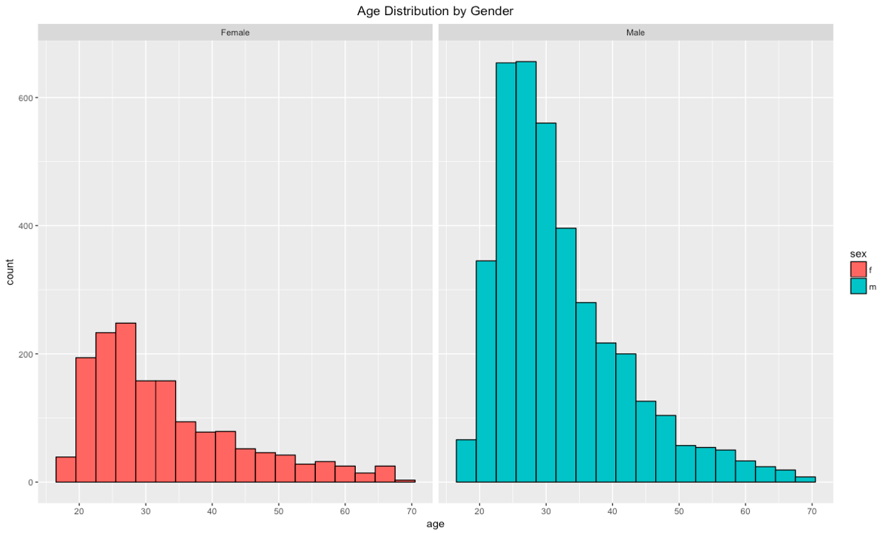

Antoine Marthey: am4665 

Ikkei Itoku: ii2155

# 1. Introduction

We decided to analyze OKCupid data to help our friends. [OKCupid](https://www.okcupid.com/) is a popular online dating service and it has 10 million members and 1 million active users. Our friends, John and Sarah have been going to dates for a while but they are having a hard time finding the right people to be their potential boyfriend/girlfriend. So we decided to help our friends utilizing our data analysis and visualization skills. Here are their profiles. 

Friend Name   |Age |Ethnicity |Height |Occupation        |Notes                                                         |
--------------|----|----------|-------|------------------|--------------------------------------------------------------|
John          |27  |White     |5.9    |Software Engineer |He graduated from Columbia Engineering School 3 years ago living in San Francisco. He is an easy going and fun person to hang out with. He is quite athletic so he would like a woman who also likes to go to gym or watch sport games together. He wants her to be around his age. No preference for ethnicity or religion |
Sarah         |35  |Asian     |5.3    |Boutique Business Owner|She is a very successful entrepreneur. She owns 9 boutique stores in Oakland CA. She dropped out of college to open up her dream store. Since then she has been working quite hard and she has no time to find a boyfriend. Most of her co-workers are women so she does not have much opportunities to new men at work. She is looking for a man who is also wealthy. She likes tall and fit guys. She is not interested in young college students. Other than that she is open.


We found that a group of researchers at Middlebury College and Reed College scraped OKCupid profile pages and we decided to utilize it. The data can be found here [https://github.com/rudeboybert/JSE_OkCupid/blob/master/profiles.csv.zip](https://github.com/rudeboybert/JSE_OkCupid/blob/master/profiles.csv.zip) After exploring the data, we created our own mapping, which is included along with this notebook, to clean up and aggregate labels for education and jobs. We will explain this mapping step more in details in "Analysis of Data Quality" section below. 


# 2. Team
As current students at the Data Science Institute of Columbia University, we decided to help our friends exploring the OKCupid dataset and applying visualization technique in order to find the right people to share their life. We work conjointly to clean and slice and dice the data. Both of us created the mapping files to bring more consistency to our research. 

Ikkei, who is a close friend of John, spent his time on finding patterns in the data and building varieties of distribution charts to understand how to utilize OKCupid. His idea was to identify any trends in order to see if our friends will be able to find their future boyfriend/girlfriend.

Antoine, who is a good friend of Sarah, spent most of his time trying to recognize interdependencies between the features and how they interact with each other. Using those two studies we came up with our recommendations and other useful advice to achieve John and Sarah's objectives.

# 3. Analysis of Data Quality
This data was already cleaned up by the researchers that originally scraped the data, especially for non-text columns. So it was relatively clean. However, there were still a few steps we needed to perform.

#### 1). Data Filtering
The main task here for us was to select the records without missing values. We decided to discard the data if any of the key fields were not filled out. This is to mitigate the risk. For example, John and Sarah would not want to meet the people who did not fill out their gender. A profile without gender seems odd. Similarly, if job field was left blank, this person might not have a job or might be trying to hide something. For this study, simply discarding these records is the appropriate action. We are not trying to solve machine learning problem. Rather, our goal is to narrow down the choices for our friends so that they can only meet the people they are looking for. Here is a list of filters we applied for.

Field            |Note
-----------------|------------------------------
age              |Cannot be blank
body_type        |Cannot be blank
diet             |Cannot be blank
drinks           |Cannot be blank
education        |Cannot be blank
ethnicity        |Cannot be blank
job              |Cannot be blank
City             |Cannot be blank
orientation      |Cannot be blank
religion         |Cannot be blank
sex              |Cannot be blank
status           |Cannot be blank
height           |Has to be greater than 40 inch
income           |Has to be greater than 0

#### 2). Custom data mapping
Another important task for us was to create our own data mapping for education and job. We went through each record and carefully created and tuned these mapping data sets. For example, "graduated from masters program" and "masters program" mean exactly the same thing. In addition, we decided to categorize "dropped out of ph.d program" also into the same group as it is likely that they have completed master's degree prior to PhD programs or have been awarded master's degree by completing the first two years of PhD program.


# 4. Executive Summary

Today,technologymade dating much easier since online dating services help to connect millions of single (or not) people together.
Approximately 15% of U.S. adults report they have used online dating services or mobile dating apps (source [http://www.pewresearch.org/fact-tank/2016/02/29/5-facts-about-online-dating/](http://www.pewresearch.org/fact-tank/2016/02/29/5-facts-about-online-dating/)) So the question is how to identify the right people out of millions of online users to meet with. To this question, Ikkei and Antoine (two data scientists from Columbia University) brought insights on the data in order to help their two friends, Sarah and John.

While most of the users are men in their 20s, there are still some diversity in terms of age for the OKCupid users. In order to help our friends in their search, we aggregated data to narrow down their options and to save them some time.
```{r,echo=FALSE}
library(knitr)

```

Based on approximately 5 thousand profiles in the San Francisco area, where Sarah and John live, various types of people with different background, hobbies, characteristics and work industries can be found. 

```{r,echo=FALSE}
library(knitr)

```

With approximately 71% of male visiting the website, the task seems easier for Sarah, but based on her strict criteria of age, education, job group or income, it might be a hustle.

Through this paper, we will perform detailed analysis to find the perfect match and understand the distribution and the correlation of the features. Lastly, our ultimate objective is help Sarah and John to find their potential match by advising the right people to meet with.


```{r,echo=FALSE}
library(knitr)

```

We sucssessfully identified the potential users who our friends, Sarah and John, might be interested in based on their personal preferences. Lastly, we can further inprove this analysis by 
  * analyzing the self introductions (free textc fields), in order to understand more about the people
  * use machine learning to match our friends to the right people

# 5. Main Analysis

To start with, import all the necessary libraries.

```{r results='hide', message=FALSE, warning=FALSE}
library(ggplot2)
library(ggmap)
library(maps)
library(mapdata)
library(tidyr)
library(dplyr)
library(scales)
library(GGally)
library(stringr)
library(viridis)
library(parcoords)
library(stringi)
library(alluvial)
```

### 5.1 Import and clean data

The first step is to import the data and to perform some pre-processing/cleaning.

Here are out steps of the cleaning process:

1. Import the raw data, and create Variable called "profiles".

2. Transform the data into known data types such as numeric values, dates or strings.

3. Select the complete profiles, meaning the users who completed all key features. We also decided to drop the column containing essays (Long strings describing mostly personality). The variable will later be called "complete_profile".
  
4. Import the two pre-processed mapping files. This step will be useful in terms of binning categories and make graphs easier to read.

5. "Merge" allow us to work from one unique dataframe, having all information grouped together.

```{r results='hide', message=FALSE, warning=FALSE}
# import dataset
okcupid_raw <- read.csv('../profiles.csv',header = TRUE,sep = ',')

# seperate city and state into two different column
okcupid <- okcupid_raw %>% separate(location, c('City','State'), sep =',')

okcupid$height <- as.numeric(as.character(okcupid$height))
okcupid$income <- as.numeric(as.character(okcupid$income))
okcupid$age <- as.numeric(as.character(okcupid$age))

complete_profile <- okcupid %>% filter(age!='' & body_type!='' & diet!='' & drinks!='' & education!='' & ethnicity!='' &
                                         height>40 & income > 0 &  job!='' & City!='' & orientation!='' & religion != '' & 
                                         sex!='' & status!='')

drops <- c('essay0', 'essay1', 'essay2', 'essay3', 'essay4', 'essay5', 'essay6', 'essay7', 'essay8', 'essay9', 'last_online',
           'smokes', 'drugs', 'offspring', 'pets', 'sign', 'speaks')
complete_profile <- complete_profile[ , !(names(complete_profile) %in% drops)]

job_map <- read.csv('job_map.csv',header = TRUE,sep = ',')
complete_profile <- merge(x=complete_profile, y=job_map, by='job', all.x = TRUE)

edu_map <- read.csv('education_map.csv',header = TRUE,sep = ',')
complete_profile <- merge(x=complete_profile, y=edu_map, by='education', all.x = TRUE)

geo <- read.csv('data_county.csv',header = TRUE,sep = ',')
```

### 5.2 Data exploration by gender

To start with the initial analyse, we decided to look at the distribution of the gender, males vs females. This visualization confirmed our intuition and found out that it might be easier for Sarah than for John to find a match.

```{r}
ggplot(data=complete_profile, aes(sex, fill=sex)) + 
  geom_bar(col=1) +
  ggtitle('Profiles by Gender') +
  theme(plot.title = element_text(hjust = 0.5)) +
  scale_x_discrete(labels=c('Female', 'Male'))
```

A second visualization is the distribution of age for the "complete_profile". Our friends are in their late 20s and 30s and looking for partners who are in their age group. The distribution graph help us to understand what age group we are more likely to encounter. It seems to be a Gaussian distribution with a mean around 27 year old. 

```{r}
gender_labels = c(`f` = 'Female', `m` = 'Male')

ggplot(complete_profile, aes(age, fill=sex)) + 
  geom_histogram(col=1, binwidth=3) +
  facet_grid(~sex, labeller = as_labeller(gender_labels)) +
  ggtitle('Age Distribution by Gender') +
  theme(plot.title = element_text(hjust = 0.5))
```

We were also interested in the relationship status of the users. They are mostly single, but there are more mysterious labels, ie "available" and "seeing someone". Interesting point is that some married people are active OKCupid users. This is an important observation, since Sarah is really looking for someone single to start a sincere relationship.

```{r}
ggplot(complete_profile, aes(status, fill=sex)) + 
  geom_bar(col=1) +
  facet_grid(~sex, labeller = as_labeller(gender_labels)) +
  ggtitle('Status Distribution by Gender') +
  theme(plot.title = element_text(hjust = 0.5)) +
  theme(axis.text.x = element_text(angle = 90, hjust = 1))
```

Since there are mostly single people using the service, we wanted to analyze more about the distribution of people who are not single. Around 100 people are married, which represents 1.6% of the users. For the rest, we see that people in "available" or "seeing someone" categories are evenly balanced, representing around 7.2% of this dataset.

```{r}
ggplot(filter(complete_profile, !status %in% c('single', 'unknown')), aes(status, fill=sex)) + 
  geom_bar(col=1) +
  facet_grid(~sex, labeller = as_labeller(gender_labels)) +
  ggtitle('People Are Always Looking For Dates') +
  theme(plot.title = element_text(hjust = 0.5)) +
  theme(axis.text.x = element_text(angle = 90, hjust = 1))
```

As Sarah cares about meeting a wealthy guy, we focused on the income data. With a boxplot, we analyzed the distribution of income by gender. Since we have some outlines making a lot of money, it is difficult to understand the distribution of the income.

```{r}
ggplot(complete_profile, aes(sex, income, fill=sex)) + 
  geom_boxplot() + 
  ggtitle('Income by Gender') +
  theme(plot.title = element_text(hjust = 0.5)) +
  scale_y_continuous(labels = comma) +
  scale_x_discrete(labels=c('Female', 'Male'))
```

To understand the distribution better, we decided to zoom into the income ranging from $20K to $170K. We can see that men tend to make more (median is higher for men than for women, the 75% percentile as well).

```{r}
ggplot(complete_profile, aes(sex, income, fill=sex)) + 
  geom_boxplot() + 
  ggtitle(bquote(atop(bold(.('Income by Gender')), atop(.('Just zoomed in version'), '')))) +
  theme(plot.title = element_text(hjust = 0.5)) +
  scale_y_continuous(limits = c(20000, 170000), labels = comma) +
  scale_x_discrete(labels=c('Female', 'Male'))
```

### 5.3 Data exploration by body type

Another interesting study is to understand how users define themselves. As defining body type is a subjective, we wanted to visualize the distribution of body types based on relationship status. To do so, we sorted body types by BMI (we also sorted "rather not say" and "used up" at the top of the list, since those two criteria don't indicate any BMI reference). From this distribution, we can see that most of the people consider themselves "average", "athletic" or "fit". 

```{r}
body_type_order = c('rather not say', 'used up', 'skinny', 'thin', 'average', 'athletic', 'fit', 'a little extra', 'curvy', 
                    'full figured', 'jacked', 'overweight')
complete_profile$body_type = factor(complete_profile$body_type, levels=body_type_order)

body_type_data <- complete_profile %>% group_by(sex,body_type,status) %>% summarise(Count=n())

ggplot(body_type_data, aes(x = status, y = Count, fill = body_type)) +
  geom_bar(stat='identity', position='dodge', col=1) + 
  xlab('Status') + 
  ylab('Frequence') + 
  ggtitle('Distribution of the Body Type By Relationship Status') + 
  theme(plot.title = element_text(hjust = 0.5)) +
  scale_fill_brewer(palette='Paired')
```

To understand the difference on how women and men classify themselves,  we decided to facet wrap the distribution of single users. Interestingly, the distribution for women is more evenly balanced between "average", "fit" and "curvy".

```{r}
single <- filter(complete_profile,complete_profile$status=='single')
grouped_single <- single %>% group_by(status, sex, body_type) %>% summarise(Count=n())

ggplot(grouped_single, aes(x=status, y=Count)) +
  geom_bar(stat='identity', position='dodge', col=1, aes(fill=body_type)) + xlab('Body_type') + ylab('Count') +
  ggtitle('Count distribution of Body Types by Gender') + theme(plot.title = element_text(hjust = 0.5)) +
  facet_grid(~sex, labeller = as_labeller(gender_labels)) +
  scale_fill_brewer(palette='Paired')
```

In terms of density, again the around 25% of female and male consider themselves as average.

```{r}
single <- filter(complete_profile,complete_profile$status=='single')
grouped_single <- single %>% group_by(status, sex, body_type) %>% summarise(Count_2=n()) %>% mutate(freq = Count_2 / sum(Count_2))
ggplot(grouped_single, aes(x=status, y=freq)) +
  geom_bar(stat='identity', position='dodge', col=1, aes(fill=body_type)) + xlab('Body_type') + ylab('Count') +
  ggtitle('Density distribution of Body Types by Gender') + theme(plot.title = element_text(hjust = 0.5)) +
  facet_grid(~sex, labeller = as_labeller(gender_labels)) +
  scale_fill_brewer(palette='Paired')
```

### 5.4 Income analysis by location

In order for Sarah and John to find the right people, we want to recommend some good areas to maximize the likelihood to find a partner. To answer this question, we decided to analyze the locations of the users that make more than $150K (this value can vary if needed). To do so, we first built a map of California and aggregated by income and county (our R variable is called "sub-region"). 

```{r}
usa <- map_data('usa')
w2hr <- map_data('world2Hires')
states <- map_data('state')
counties <- map_data('county')

complete_profile$State <- trimws(complete_profile$State)
city_count <- complete_profile[complete_profile$income >= 150000,]  %>% group_by(City,sex) %>% summarize(Frequence = n())

geo$city <- tolower(geo$city)
geo$county <- tolower(geo$county)

geo <- filter(geo, geo$state=='CA')
geo <- geo[,c('city','county')]
geo <- unique(geo)

city_count <- merge(x=city_count, y=geo, by.x='City', by.y='city')
city_count <- city_count %>% group_by(county) %>% summarize(Count = sum(Frequence))

colnames(city_count)[1] <-'region'

california <- subset(states, region == 'california')

ca_counties <- subset(counties, region == 'california')
colnames(city_count)[1] <-'subregion'
ca_data <- inner_join(ca_counties, city_count, by = 'subregion')

no_axe <- theme(
  axis.text = element_blank(),
  axis.line = element_blank(),
  axis.ticks = element_blank(),
  panel.border = element_blank(),
  panel.grid = element_blank(),
  axis.title = element_blank()
)

ca_map <- ggplot(data = california, mapping = aes(x = long, y = lat, group = group)) +
  coord_fixed(1.3) +
  geom_polygon(color = 'black', fill = 'gray') +
  scale_fill_viridis()

ca_map <- ca_map +
  geom_polygon(data = ca_data, aes(fill = Count), color = 'white') +
  geom_polygon(color = 'black', fill = NA) +
  theme_bw() +
  ggtitle('Count of people earning more than 150K a year') +
  no_axe
ca_map
```

We then zoomed on San Francisco area. The richer users are located in the Silicon Valley and in San Francisco. The surrounding neighborhoods are less wealthy. Hence, we would recommend Sarah and John to meet the people in the Silicon Valley and in San Francisco.

```{r}
ca_map + coord_fixed(xlim = c(-123, -120.0),  ylim = c(35, 40), ratio = 1)
```

### 5.5 Relationship of income and other key variables with pairs plot

```{r results='hide', message=FALSE, warning=FALSE}

# decided to set the uppper limit of $250k to filter out the suspicious profiles 
# and also our friends might not fit well with thoese people
complete_profile <- complete_profile %>% filter(income <= 250000 & age < 60)

data_ggpairs <- complete_profile[,c('age','income', 'height','education_level')]
data_ggpairs <- data_ggpairs[!rowSums(data_ggpairs[2] >200000),]

my_fn <- function(data, mapping, method='loess', ...){
      p <- ggplot(data = data, mapping = mapping) + 
      geom_point() + 
      geom_smooth(method=method, ...)
      p
    }

   
ggpairs(data_ggpairs, lower = list(continuous = my_fn))
```

This pairs plot shows some interesting factors to find an ideal partner for John and Sarah.

##### Age
* **Age graph** (row 1, column 1): most of the OKCupid are in 20s and 30s, which is a great news for our friends. 
* **Age and income** graph (row 2, column 1): income goes up till people turn around 40 years old and then gradually goes down.
* **Age and height** (row 3, column 1): no relationship between age and height. It is a good news for Sarah as she likes tall guys.
* **Age and education** (row 4, column 1): no surprise here. As people earn higher education they get older. 7 is PhD, 6 master, 5 bachelor etc..

##### Income
* **Income graph** (row 2, column 2): there are four small humps. The first hump is at $20,000. Mainly students are in this group. Second hump is at $80,000. This data set is for San Francisco area, where many engineers are. The average income for them is $84,000, which is inline with this group. We aslo see a hump around $100,000. We consider this is due to fact that people like to say $100,000 if their income is relatively close to it. The last one is at $1M, which is the upper limit for OKCupid. Some people who actually make more money would choose it. Another reason we can think of is that some people who tired to be funny or decided not to answer this question and chose it.
* **Income and height** (row 3, column 2): there is no relationship between income and height
* **Income and education** (row 4, column 2): there is a slight relationship. As people earn higher education their income tends to go up a bit

##### Height
* **Height graph** (row 3, column 3): height is normally distributed

##### Education
* **Education graph** (row 3, column 3): there are two humps. The first one is at 2, which is a student group. Data shows that a lot of students use OKCupid. Despite the fact that there are manyopportunities to socialize and meet new people. The other one is at 5, which is bachelor degree. 


### 5.6 Relationship of income and other key variables with heatmap

```{r}
 complete_profile$age_bin <- cut(complete_profile$age, breaks=seq(10, 70, by=5))

income_count_age_job <- complete_profile %>% group_by(age_bin, job_group) %>% summarise(IncomeCount = n(), AverageIncome = mean(income))

title <- 'Average Income by Job and Age'
subheader <- 'White numbers indicate the count'

ggplot(income_count_age_job, aes(age_bin, job_group, fill = AverageIncome)) +
  geom_tile() +
  geom_text(aes(label = IncomeCount), colour = "white", size = 3) +
  ggtitle(bquote(atop(bold(.(title)), atop(.(subheader), "")))) +
  xlab('Age') + 
  ylab('Job group') + 
  theme(plot.title = element_text(hjust = 0.5)) +
  guides(color = FALSE) + 
  scale_fill_viridis()

```
This heatmap tells some interesting stories. 

* People in travel industries do not make much money regardless of their age
* From this data we can see that people in tech are relatively doing well. Given the fact that this for San Francisco, it makes sense. Sarah would be happy to know that there are 331 people who fit in her criteria.
* People in medical field make good money later in their career.
* Executive is the exception here. It defines the seniority in companies. All the other ones are industries. So there is no surprise that executives make more money than other groups.
* Artist is an interesting category. There are a lot of artists who are in their 20s and 30s and they do not make much money. However, once they get into their 40s, the population significantly decreases and the average income goes up close to $100,000. 


```{r}
income_count_sex_job <- complete_profile %>% group_by(sex, job_group) %>% summarise(IncomeCount = n(), AverageIncome = mean(income))

options(scipen=10000)

ggplot(income_count_sex_job, aes(sex, job_group, fill = AverageIncome)) +
  geom_tile() +
  geom_text(aes(label = sprintf('$%s', format(round(AverageIncome, 0), big.mark=','))), colour = 'red', size = 3) +
  ggtitle('Average Income by Job and Gender') +
  xlab('Gender') + 
  ylab('Job group') + 
  theme(plot.title = element_text(hjust = 0.5)) +
  guides(color = FALSE) +
  scale_fill_viridis() +
  scale_x_discrete(labels=c('Female', 'Male'))
```

When we look at this heatmap, we can tell some more interesting stories. 

* Travel industry is the only field where there is no income gap between genders.
* There are a lot less females in tech industry and also they make less money than males.
* Surprisingly people in medical field do not make much money. This is likely due to that fact that their salary is low during their residency and fellowship.
* Income gap among males and females is the largest for financial industry. Also male financial professionals make about the same as executives.

### 5.7 Find an ideal candidate!

```{r}
#only select single people

education_order = c('other', 'in school', 'high school', 'associate', 'bachelor', 'master', 'phd')
complete_profile$education_group = factor(complete_profile$education_group, levels=education_order)

single <- complete_profile[complete_profile$status=='single',]

body_type_order = c('rather not say', 'used up', 'skinny', 'thin', 'average', 'athletic', 'fit', 'a little extra', 'curvy', 
                    'full figured', 'jacked', 'overweight')
complete_profile$body_type = factor(complete_profile$body_type, levels=body_type_order)


single$age_bin <- cut(single$age, breaks=seq(10, 70, by=10))
single$age_bin <- stri_sub(single$age_bin, 2,3)
single$income_k <- single$income / 1000
single$income_k[single$income_k >= 200] <- 200

grouped <- rename(count(single, sex, age_bin, education_group, job_group, income_k), Freq = n)

alluvial(grouped[,1:5], freq=grouped$Freq, border=NA,
         hide = grouped$Freq < quantile(grouped$Freq, .75),
         col=ifelse(grouped$income_k >= 150, 'red', 'gray'))
```

This alluvial plot shows how the key factors relate to each other. 

* First thing we notice is that most of the people who make more than $150,000 are male. Even taking the fact that there are more male OKCupid users into consideration, this was a surprise for us and John would not be too happy to hear that. 
* Second, we see some tendency that people who have earned higher education make more money. 
* Third, a lot of the wealthy users are male who are their 30s and 40s. This is a great news for Sarah

```{r}
data_ggpar <- complete_profile[,c('sex', 'orientation', 'status', 'age', 'height','body_type', 'drinks', 'job_group', 'income')]

parcoords(data_ggpar
         ,rownames = F 
         ,brushMode = '1D-axes'
         ,reorderable = T
         ,queue = T
         ,color = list(colorBy = 'Region' ,colorScale = htmlwidgets::JS('d3.scale.category10()')))
```
This parallel coordinate plot is very powerful. It lets our friends find exactly the people they would like to meet. Here are how their ideal candidates would look like. They have different preferences but it looks like both of them have many options.


<div style="width:600px; height=500px">
<b>- Ideal candidates for John</b>

</div>

<div style="width:600px; height=500px">
<b>- Ideal candidates for Sarah</b>

</div>

# 6. Conclusion
### Overall
We found OKCupid dataset very interesting. There are a lot of stories we could tell by analyzing this such as the relationship of income and occupation or age. We used many different plots, which we learned in class to slice and dice the data to extract meaningful information. At the end we effectively identified our recommendations of the people who we believe our friends John and Sarah should meet. We will validate our recommendations and analysis by carefully monitoring the progress of their dates. 

### Limitation
One kind of data we wish we had was user popularity or likes. With that we could have analyzed to understand what features make people attractive especially on online dating services. That would have been a very interesting analysis. We could also have built a machine learning model to predict future likes and our friends could have edited their profile before submitting.

Another data we wish we had was user profile pictures. They would have enabled us to conduct very interesting analysis. Along with likes, pictures, and profiles we believe we can accurately predict how a new user will do on OKCupid. 

### Future Steps
The next step of the analysis is to dig more into other features of the dataset. If we want to be more accurate and find our friends a perfect match, the best idea is to look into the self introduction part (free text) to match the criteria they are looking for.

Here is a quick example of what we could do next. It shows the percentage of the users who used the word "love" in their introduction. We can see that female tend to use it more than male.
```{r}
okcupid <- okcupid %>% filter(sex!='' & status!='')
essays<- select(okcupid,starts_with('essay'))
essays<- apply(essays,MARGIN=1, FUN=paste,collapse=' ')
essays<- str_replace_all(essays,'\n', ' ')
essays<- str_replace_all(essays,'<br />', ' ')

okcupid$has_love<- str_detect(essays,'love')
mosaic::tally(has_love ~ sex, okcupid, format='proportion')
```
